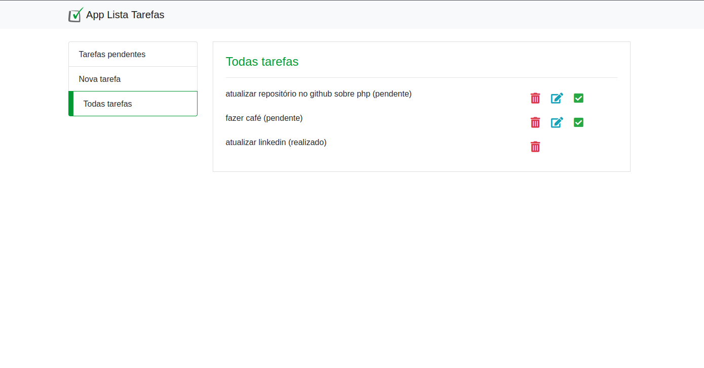

<p align="center">
  <h1>
    App – Lista de Tareas (PHP)
  </h1>
</p>

<div style="display: flex; align-items: center; padding: 10px;">
  <span>
    <a href="https://github.com/rafael-o-cunha/rafael-o-cunha">
        
    </a>
</span>
</div>

---

<div style="display: flex; align-items: center; padding: 10px;">
  <span>
    <a href="https://github.com/rafael-o-cunha/App-Lista-de-Tarefas/blob/main/README.md">
      
    </a>
  </span>

  <span>
    <a href="https://github.com/rafael-o-cunha/App-Lista-de-Tarefas/blob/main/README_EN.md">
      
    </a>
  </span>

  <span>
    <a href="https://github.com/rafael-o-cunha/App-Lista-de-Tarefas/blob/main/README_ES.md">
      
    </a>
  </span>
</div>

---

<div style="display: flex; align-items: center; padding: 10px;">
   <span style="margin-right: 15px">
    
  </span>
  <span style="margin-right: 15px">
    
  </span>
</div>

---


Microproyecto práctico desarrollado en **2021** con **PHP puro (7.4)** y **MySQL (5.7)**, con el objetivo de ejercitar los fundamentos del desarrollo web backend **sin frameworks**.

El proyecto implementa un **CRUD simple de tareas**, sirviendo como experimento técnico y material de estudio. Actualmente se encuentra **organizado y documentado** como parte de la curaduría del repositorio.


## Qué exploré

Este proyecto funciona como un **registro de entrenamiento técnico**, enfocado menos en listas de verificación y más en la investigación práctica:

- PHP puro, sin frameworks ni ORMs
- Conexión directa a MySQL utilizando **PDO**
- Uso de **consultas SQL preparadas** para operaciones básicas
- Organización mínima entre:
  - Modelo
  - Servicio
  - Controlador
- Manejo de formularios HTTP (GET / POST)
- Separación simple entre la lógica de negocio y los archivos públicos


## Problema / motivación

La motivación fue experimentar, de forma controlada, **cómo estructurar una aplicación web mínima en PHP**, buscando comprender:

- Dónde surge la complejidad incluso en proyectos pequeños
- Cómo organizar responsabilidades sin el apoyo de frameworks
- El costo cognitivo de mantener código acoplado frente a una separación mínima
- La relación directa entre el código PHP, las consultas SQL y el flujo HTTP

Desde esta perspectiva, el proyecto se comporta más como un **experimento técnico** que como un ejercicio guiado.


## Recursos utilizados

- **PHP 7.4**
- **MySQL 5.7**
- **PDO**
- HTML / CSS / JavaScript básicos
- Docker (añadido posteriormente, únicamente para facilitar la ejecución)

> El uso de Docker fue incorporado posteriormente solo para hacer el proyecto reproducible, sin alterar su propuesta original.


## Cómo ejecutar (vía Docker)

Requisitos:
- Docker
- Docker Compose
- Make (en entornos Linux es posible ejecutar el proyecto mediante el Makefile)

```bash

docker-compose up --build

# Usando el Makefile – construye y ejecuta los contenedores (se eliminan automáticamente al detenerse)
make run 

# Usando el Makefile – limpia el entorno, eliminando imágenes y volúmenes
make clean

```

---

## preview


